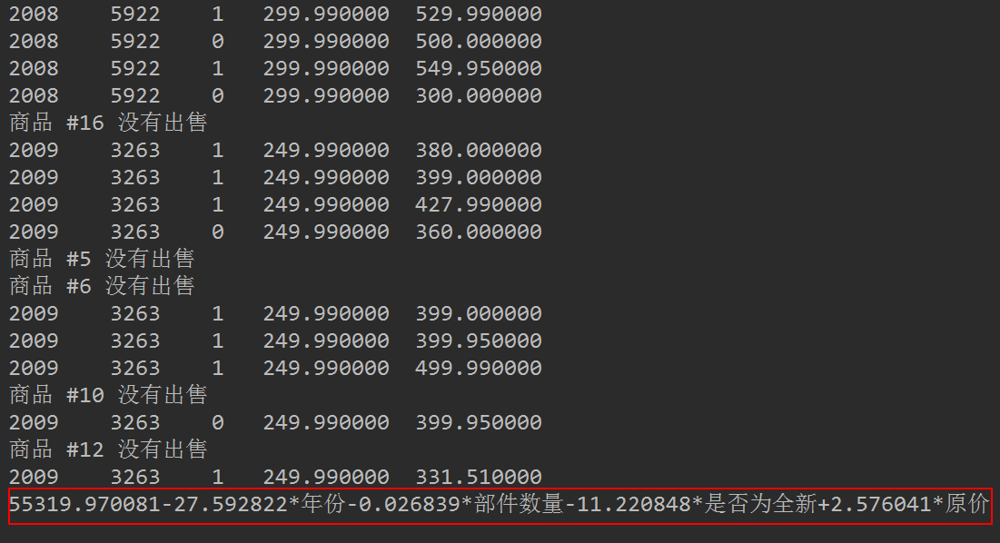

## 一、前言
---
本文将会对连续型的数据做出预测。主要讲解简单的线性回归和局部加权线性回归，并通过预测鲍鱼年龄和乐高玩具套件的二手价格的实例进行实战演练。

本文出现的所有代码，均可在我的github上下载，欢迎Follow、Star：[Github地址](https://github.com/yaoguangju/machine_learning)

## 二、什么是回归？
---
回归的目的是预测数值型的目标值。最直接的办法是依据输入写出一个目标值的计算公式。假如你想预测小姐姐男友汽车的功率，可能会这么计算：

<center>**HorsePower = 0.0015 * annualSalary - 0.99 * hoursListeningToPublicRadio**</center>

写成中文就是：

<center>**姐姐男友汽车的功率 = 0.0015 * 姐姐男友年薪 - 0.99 * 收听公共广播的时间**</center>

这就是所谓的回归方程（regression equation），其中的0.0015和-0.99称为回归系数（regression weights），求这些回归系数的过程就是回归。一旦有了这些回归系数，再给定输入，做预测就非常容易了。具体的做法是用回归系数乘以输入值，再将结果全部加在一起，就得到了预测值。

说到回归，一般都是指线性回归（linear regression），所以本文里的回归和线性回归代表同一个意思。线性回归意味着可以将输入项分别乘以一些常量，再将结果加起来得到输出。需要说明的是，存在另一种成为非线性回归的回归模型，该模型不认同上面的做法，比如认为输出可能是输入的乘积。这样，上面的功率计算公式也可以写做：

<center>**HorsePower = 0.0015 * annualSalary / hoursListeningToPublicRadio**</center>

这就是一个非线性回归的例子，本文对此不做深入讨论。

## 三、揭开回归的神秘面纱
---
#### 1、用线性回归找到最佳拟合直线
应该怎么从一大堆数据里求出回归方程呢？假定输入数据存放在矩阵X中，结果存放在向量y中：


而回归系数存放在向量w中：


那么对于给定的数据x1，即矩阵X的第一列数据，预测结果u1将会通过如下公式给出：


现在的问题是，手里有数据矩阵X和对应的标签向量y，怎么才能找到w呢？一个常用的方法就是找出使误差最小的w。这里的误差是指预测u值和真实y值之间的差值，使用该误差的简单累加将使得正差值和负差值相互抵消，所以我们采用平方误差。

平方误差和可以写做：


用矩阵表示还可以写做：


为啥能这么变化，记住一个前提：若x为向量，则默认x为列向量，x^T为行向量。将上述提到的数据矩阵X和标签向量y带进去，就知道为何这么变化了。

在继续推导之前，我们要先明确一个目的：找到w，使平方误差和最小。因为我们认为平方误差和越小，说明线性回归拟合效果越好。

现在，我们用矩阵表示的平方误差和对w进行求导：


令上述公式等于0，得到：


w上方的小标记表示，这是当前可以估计出的w的最优解。从现有数据上估计出的w可能并不是数据中的真实w值，所以这里使用了一个"帽"符号来表示它仅是w的一个最佳估计。

值得注意的是，上述公式中包含逆矩阵，也就是说，这个方程只在逆矩阵存在的时候使用，也即是这个矩阵是一个方阵，并且其行列式不为0。

述的最佳w求解是统计学中的常见问题，除了矩阵方法外还有很多其他方法可以解决。通过调用NumPy库里的矩阵方法，我们可以仅使用几行代码就完成所需功能。该方法也称作OLS， 意思是“普通小二乘法”（ordinary least squares）。

我们先看下数据集，数据下载地址：[数据集下载](https://github.com/yaoguangju/machine_learning/blob/master/%E7%BA%BF%E6%80%A7%E5%9B%9E%E5%BD%92/1.%E6%8F%AD%E5%BC%80%E5%9B%9E%E5%BD%92%E7%9A%84%E7%A5%9E%E7%A7%98%E9%9D%A2%E7%BA%B1/ex0.txt)


第一列都为1.0，即x0。第二列为x1，即x轴数据。第三列为x2，即y轴数据。首先绘制下数据，看下数据分布。编写代码如下：
```python
# -*- coding:utf-8 -*-
import matplotlib.pyplot as plt
import numpy as np

def loadDataSet(fileName):
    """
    函数说明:加载数据
    Parameters:
        fileName - 文件名
    Returns:
        xArr - x数据集
        yArr - y数据集

    """

    numFeat = len(open(fileName).readline().split('\t')) - 1
    xArr = []; yArr = []
    fr = open(fileName)
    for line in fr.readlines():
        lineArr =[]
        curLine = line.strip().split('\t')
        for i in range(numFeat):
            lineArr.append(float(curLine[i]))
        xArr.append(lineArr)
        yArr.append(float(curLine[-1]))
    return xArr, yArr

def plotDataSet():
    """
    函数说明:绘制数据集
    Parameters:
        无
    Returns:
        无

    """
    xArr, yArr = loadDataSet('ex0.txt')                                    #加载数据集
    n = len(xArr)                                                        #数据个数
    xcord = []; ycord = []                                                #样本点
    for i in range(n):                                                   
        xcord.append(xArr[i][1]); ycord.append(yArr[i])                    #样本点
    fig = plt.figure()
    ax = fig.add_subplot(111)                                            #添加subplot
    ax.scatter(xcord, ycord, s = 20, c = 'blue',alpha = .5)                #绘制样本点
    plt.title('DataSet')                                                #绘制title
    plt.xlabel('X')
    plt.show()

if __name__ == '__main__':
    plotDataSet()
```

运行代码如下：


通过可视化数据，我们可以看到数据的分布情况。接下来，让我们根据上文中推导的回归系数计算方法，求出回归系数向量，并根据回归系数向量绘制回归曲线，编写代码如下：
```python
# -*- coding:utf-8 -*-
import matplotlib.pyplot as plt
import numpy as np

def loadDataSet(fileName):
    """
    函数说明:加载数据
    Parameters:
        fileName - 文件名
    Returns:
        xArr - x数据集
        yArr - y数据集

    """
    numFeat = len(open(fileName).readline().split('\t')) - 1
    xArr = []; yArr = []
    fr = open(fileName)
    for line in fr.readlines():
        lineArr =[]
        curLine = line.strip().split('\t')
        for i in range(numFeat):
            lineArr.append(float(curLine[i]))
        xArr.append(lineArr)
        yArr.append(float(curLine[-1]))
    return xArr, yArr

def standRegres(xArr,yArr):
    """
    函数说明:计算回归系数w
    Parameters:
        xArr - x数据集
        yArr - y数据集
    Returns:
        ws - 回归系数

    """
    xMat = np.mat(xArr); yMat = np.mat(yArr).T
    xTx = xMat.T * xMat                            #根据文中推导的公示计算回归系数
    if np.linalg.det(xTx) == 0.0:
        print("矩阵为奇异矩阵,不能求逆")
        return
    ws = xTx.I * (xMat.T*yMat)
    return ws

def plotRegression():
    """
    函数说明:绘制回归曲线和数据点
    Parameters:
        无
    Returns:
        无

    """
    xArr, yArr = loadDataSet('ex0.txt')                                    #加载数据集
    ws = standRegres(xArr, yArr)                                        #计算回归系数
    xMat = np.mat(xArr)                                                    #创建xMat矩阵
    yMat = np.mat(yArr)                                                    #创建yMat矩阵
    xCopy = xMat.copy()                                                    #深拷贝xMat矩阵
    xCopy.sort(0)                                                        #排序
    yHat = xCopy * ws                                                     #计算对应的y值
    fig = plt.figure()
    ax = fig.add_subplot(111)                                            #添加subplot
    ax.plot(xCopy[:, 1], yHat, c = 'red')                                #绘制回归曲线
    ax.scatter(xMat[:,1].flatten().A[0], yMat.flatten().A[0], s = 20, c = 'blue',alpha = .5)                #绘制样本点
    plt.title('DataSet')                                                #绘制title
    plt.xlabel('X')
    plt.show()

if __name__ == '__main__':
    plotRegression()
```
运行结果如下：


可以看到，对角线上的数据是1.0，因为yMat和自己的匹配是完美的，而YHat和yMat的相关系数为0.98。

最佳拟合直线方法将数据视为直线进行建模，具有十分不错的表现。数据当中似乎还存在其他的潜在模式。那么如何才能利用这些模式呢？我们可以根据数据来局部调整预测，下面就会介绍这种方法。

#### 2、局部加权线性回归
线性回归的一个问题是有可能出现欠拟合现象，因为它求的是具有小均方误差的无偏估 计。显而易见，如果模型欠拟合将不能取得好的预测效果。所以有些方法允许在估计中引入一些偏差，从而降低预测的均方误差。

其中的一个方法是局部加权线性回归（Locally Weighted Linear Regression，LWLR）。在该方法中，我们给待预测点附近的每个点赋予一定的权重。与kNN一样，这种算法每次预测均需要事先选取出对应的数据子集。该算法解除回归系数W的形式如下：


其中W是一个矩阵，这个公式跟我们上面推导的公式的区别就在于W，它用来给每个店赋予权重。

LWLR使用"核"（与支持向量机中的核类似）来对附近的点赋予更高的权重。核的类型可以自由选择，最常用的核就是高斯核，高斯核对应的权重如下：


这样我们就可以根据上述公式，编写局部加权线性回归，我们通过改变k的值，可以调节回归效果，编写代码如下：
```python
# -*- coding:utf-8 -*-
from matplotlib.font_manager import FontProperties
import matplotlib.pyplot as plt
import numpy as np
def loadDataSet(fileName):
    """
    函数说明:加载数据
    Parameters:
        fileName - 文件名
    Returns:
        xArr - x数据集
        yArr - y数据集

    """
    numFeat = len(open(fileName).readline().split('\t')) - 1
    xArr = []; yArr = []
    fr = open(fileName)
    for line in fr.readlines():
        lineArr =[]
        curLine = line.strip().split('\t')
        for i in range(numFeat):
            lineArr.append(float(curLine[i]))
        xArr.append(lineArr)
        yArr.append(float(curLine[-1]))
    return xArr, yArr

def plotlwlrRegression():
    """
    函数说明:绘制多条局部加权回归曲线
    Parameters:
        无
    Returns:
        无

    """
    font = FontProperties(fname=r"c:\windows\fonts\simsun.ttc", size=14)
    xArr, yArr = loadDataSet('ex0.txt')                                    #加载数据集
    yHat_1 = lwlrTest(xArr, xArr, yArr, 1.0)                            #根据局部加权线性回归计算yHat
    yHat_2 = lwlrTest(xArr, xArr, yArr, 0.01)                            #根据局部加权线性回归计算yHat
    yHat_3 = lwlrTest(xArr, xArr, yArr, 0.003)                            #根据局部加权线性回归计算yHat
    xMat = np.mat(xArr)                                                    #创建xMat矩阵
    yMat = np.mat(yArr)                                                    #创建yMat矩阵
    srtInd = xMat[:, 1].argsort(0)                                        #排序，返回索引值
    xSort = xMat[srtInd][:,0,:]
    fig, axs = plt.subplots(nrows=3, ncols=1,sharex=False, sharey=False, figsize=(10,8))                                        
    axs[0].plot(xSort[:, 1], yHat_1[srtInd], c = 'red')                        #绘制回归曲线
    axs[1].plot(xSort[:, 1], yHat_2[srtInd], c = 'red')                        #绘制回归曲线
    axs[2].plot(xSort[:, 1], yHat_3[srtInd], c = 'red')                        #绘制回归曲线
    axs[0].scatter(xMat[:,1].flatten().A[0], yMat.flatten().A[0], s = 20, c = 'blue', alpha = .5)                #绘制样本点
    axs[1].scatter(xMat[:,1].flatten().A[0], yMat.flatten().A[0], s = 20, c = 'blue', alpha = .5)                #绘制样本点
    axs[2].scatter(xMat[:,1].flatten().A[0], yMat.flatten().A[0], s = 20, c = 'blue', alpha = .5)                #绘制样本点
    #设置标题,x轴label,y轴label
    axs0_title_text = axs[0].set_title(u'局部加权回归曲线,k=1.0',FontProperties=font)
    axs1_title_text = axs[1].set_title(u'局部加权回归曲线,k=0.01',FontProperties=font)
    axs2_title_text = axs[2].set_title(u'局部加权回归曲线,k=0.003',FontProperties=font)
    plt.setp(axs0_title_text, size=8, weight='bold', color='red')  
    plt.setp(axs1_title_text, size=8, weight='bold', color='red')  
    plt.setp(axs2_title_text, size=8, weight='bold', color='red')  
    plt.xlabel('X')
    plt.show()
def lwlr(testPoint, xArr, yArr, k = 1.0):
    """
    函数说明:使用局部加权线性回归计算回归系数w
    Parameters:
        testPoint - 测试样本点
        xArr - x数据集
        yArr - y数据集
        k - 高斯核的k,自定义参数
    Returns:
        ws - 回归系数

    """
    xMat = np.mat(xArr); yMat = np.mat(yArr).T
    m = np.shape(xMat)[0]
    weights = np.mat(np.eye((m)))                                        #创建权重对角矩阵
    for j in range(m):                                                  #遍历数据集计算每个样本的权重
        diffMat = testPoint - xMat[j, :]                                 
        weights[j, j] = np.exp(diffMat * diffMat.T/(-2.0 * k**2))
    xTx = xMat.T * (weights * xMat)                                        
    if np.linalg.det(xTx) == 0.0:
        print("矩阵为奇异矩阵,不能求逆")
        return
    ws = xTx.I * (xMat.T * (weights * yMat))                            #计算回归系数
    return testPoint * ws
def lwlrTest(testArr, xArr, yArr, k=1.0):  
    """
    函数说明:局部加权线性回归测试
    Parameters:
        testArr - 测试数据集
        xArr - x数据集
        yArr - y数据集
        k - 高斯核的k,自定义参数
    Returns:
        ws - 回归系数

    """
    m = np.shape(testArr)[0]                                            #计算测试数据集大小
    yHat = np.zeros(m)    
    for i in range(m):                                                    #对每个样本点进行预测
        yHat[i] = lwlr(testArr[i],xArr,yArr,k)
    return yHat
if __name__ == '__main__':
    plotlwlrRegression()
```

运行结果如下：


可以看到，当k越小，拟合效果越好。但是当k过小，会出现过拟合的情况，例如k等于0.003的时候。

## 四、预测鲍鱼的年龄
---
接下来，我们将回归用于真是数据。在abalone.txt文件中记录了鲍鱼（一种水生物）的年龄，这个数据来自UCI数据集合的数据。鲍鱼年龄可以从鲍鱼壳的层数推算得到。

数据集下载地址：[数据集下载](https://github.com/yaoguangju/machine_learning/blob/master/%E7%BA%BF%E6%80%A7%E5%9B%9E%E5%BD%92/2.%E9%A2%84%E6%B5%8B%E9%B2%8D%E9%B1%BC%E7%9A%84%E5%B9%B4%E9%BE%84/abalone.txt)

数据集的数据如下：


可以看到，数据集是多维的，所以我们很难画出它的分布情况。每个维度数据的代表的含义没有给出，不过没有关系，我们只要知道最后一列的数据是y值就可以了，最后一列代表的是鲍鱼的真实年龄，前面几列的数据是一些鲍鱼的特征，例如鲍鱼壳的层数等。我们不做数据清理，直接用上所有特征，测试下我们的局部加权回归。

新建abalone.py文件，添加rssError函数，用于评价最后回归结果。编写代码如下：
```python
# -*- coding:utf-8 -*-
from matplotlib.font_manager import FontProperties
import matplotlib.pyplot as plt
import numpy as np

def loadDataSet(fileName):
	"""
	函数说明:加载数据
	Parameters:
		fileName - 文件名
	Returns:
		xArr - x数据集
		yArr - y数据集

	"""
	numFeat = len(open(fileName).readline().split('\t')) - 1
	xArr = []; yArr = []
	fr = open(fileName)
	for line in fr.readlines():
		lineArr =[]
		curLine = line.strip().split('\t')
		for i in range(numFeat):
			lineArr.append(float(curLine[i]))
		xArr.append(lineArr)
		yArr.append(float(curLine[-1]))
	return xArr, yArr

def lwlr(testPoint, xArr, yArr, k = 1.0):
	"""
	函数说明:使用局部加权线性回归计算回归系数w
	Parameters:
		testPoint - 测试样本点
		xArr - x数据集
		yArr - y数据集
		k - 高斯核的k,自定义参数
	Returns:
		ws - 回归系数

	"""
	xMat = np.mat(xArr); yMat = np.mat(yArr).T
	m = np.shape(xMat)[0]
	weights = np.mat(np.eye((m)))										#创建权重对角矩阵
	for j in range(m):                      							#遍历数据集计算每个样本的权重
		diffMat = testPoint - xMat[j, :]
		weights[j, j] = np.exp(diffMat * diffMat.T/(-2.0 * k**2))
	xTx = xMat.T * (weights * xMat)
	if np.linalg.det(xTx) == 0.0:
		print("矩阵为奇异矩阵,不能求逆")
		return
	ws = xTx.I * (xMat.T * (weights * yMat))							#计算回归系数
	return testPoint * ws

def lwlrTest(testArr, xArr, yArr, k=1.0):
	"""
	函数说明:局部加权线性回归测试
	Parameters:
		testArr - 测试数据集,测试集
		xArr - x数据集,训练集
		yArr - y数据集,训练集
		k - 高斯核的k,自定义参数
	Returns:
		ws - 回归系数

	"""
	m = np.shape(testArr)[0]											#计算测试数据集大小
	yHat = np.zeros(m)
	for i in range(m):													#对每个样本点进行预测
		yHat[i] = lwlr(testArr[i],xArr,yArr,k)
	return yHat

def standRegres(xArr,yArr):
	"""
	函数说明:计算回归系数w
	Parameters:
		xArr - x数据集
		yArr - y数据集
	Returns:
		ws - 回归系数

	"""
	xMat = np.mat(xArr); yMat = np.mat(yArr).T
	xTx = xMat.T * xMat							#根据文中推导的公示计算回归系数
	if np.linalg.det(xTx) == 0.0:
		print("矩阵为奇异矩阵,不能求逆")
		return
	ws = xTx.I * (xMat.T*yMat)
	return ws

def rssError(yArr, yHatArr):
	"""
	误差大小评价函数
	Parameters:
		yArr - 真实数据
		yHatArr - 预测数据
	Returns:
		误差大小
	"""
	return ((yArr - yHatArr) **2).sum()

if __name__ == '__main__':
	abX, abY = loadDataSet('abalone.txt')
	print('训练集与测试集相同:局部加权线性回归,核k的大小对预测的影响:')
	yHat01 = lwlrTest(abX[0:99], abX[0:99], abY[0:99], 0.1)
	yHat1 = lwlrTest(abX[0:99], abX[0:99], abY[0:99], 1)
	yHat10 = lwlrTest(abX[0:99], abX[0:99], abY[0:99], 10)
	print('k=0.1时,误差大小为:',rssError(abY[0:99], yHat01.T))
	print('k=1  时,误差大小为:',rssError(abY[0:99], yHat1.T))
	print('k=10 时,误差大小为:',rssError(abY[0:99], yHat10.T))

	print('')

	print('训练集与测试集不同:局部加权线性回归,核k的大小是越小越好吗？更换数据集,测试结果如下:')
	yHat01 = lwlrTest(abX[100:199], abX[0:99], abY[0:99], 0.1)
	yHat1 = lwlrTest(abX[100:199], abX[0:99], abY[0:99], 1)
	yHat10 = lwlrTest(abX[100:199], abX[0:99], abY[0:99], 10)
	print('k=0.1时,误差大小为:',rssError(abY[100:199], yHat01.T))
	print('k=1  时,误差大小为:',rssError(abY[100:199], yHat1.T))
	print('k=10 时,误差大小为:',rssError(abY[100:199], yHat10.T))

	print('')

	print('训练集与测试集不同:简单的线性归回与k=1时的局部加权线性回归对比:')
	print('k=1时,误差大小为:', rssError(abY[100:199], yHat1.T))
	ws = standRegres(abX[0:99], abY[0:99])
	yHat = np.mat(abX[100:199]) * ws
	print('简单的线性回归误差大小:', rssError(abY[100:199], yHat.T.A))

```

运行结果如下：


可以看到，当k=0.1时，训练集误差小，但是应用于新的数据集之后，误差反而变大了。这就是经常说道的过拟合现象。我们训练的模型，我们要保证测试集准确率高，这样训练出的模型才可以应用于新的数据，也就是要加强模型的普适性。可以看到，当k=1时，局部加权线性回归和简单的线性回归得到的效果差不多。这也表明一点，必须在未知数据上比较效果才能选取到最佳模型。那么最佳的核大小是10吗？或许是，但如果想得到更好的效果，应该用10个不同的样本集做10次测试来比较结果。

本示例展示了如何使用局部加权线性回归来构建模型，可以得到比普通线性回归更好的效果。局部加权线性回归的问题在于，每次必须在整个数据集上运行。也就是说为了做出预测，必须保存所有的训练数据。

## 五、岭回归
---
如果数据的特征比样本点还多应该怎么办？很显然，此时我们不能再使用上文的方法进行计算了，因为矩阵X不是满秩矩阵，非满秩矩阵在求逆时会出现问题。为了解决这个问题，统计学家引入岭回归（ridge regression）的概念。

#### 1、什么是岭回归？
岭回归即我们所说的L2正则线性回归，在一般的线性回归最小化均方误差的基础上增加了一个参数w的L2范数的罚项，从而最小化罚项残差平方和：


简单说来，岭回归就是在普通线性回归的基础上引入单位矩阵。回归系数的计算公式变形如下：


式中，矩阵I是一个mxm的单位矩阵，加上一个λI从而使得矩阵非奇异，进而能对矩阵求逆。

岭回归最先用来处理特征数多于样本数的情况，现在也用于在估计中加入偏差，从而得到更好的估计。这里通过引入λ来限制了所有w之和，通过引入该惩罚项，能够减少不重要的参数，这个技术在统计学中也可以叫做缩减（shrinkage）。

缩减方法可以去掉不重要的参数，因此能更好地裂解数据。此外，与简单的线性回归相比，缩减法能够取得更好的预测效果。

#### 2、编写代码
为了使用岭回归和缩减技术，首先需要对特征做标准化处理。因为，我们需要使每个维度特征具有相同的重要性。本文使用的标准化处理比较简单，就是将所有特征都减去各自的均值并除以方差。

代码很简单，只需要稍做修改，其中，λ为模型的参数。我们先绘制一个回归系数与log(λ)的曲线图，看下它们的规律，编写代码如下：
```python
# -*-coding:utf-8 -*-
from matplotlib.font_manager import FontProperties
import matplotlib.pyplot as plt
import numpy as np
def loadDataSet(fileName):
    """
    函数说明:加载数据
    Parameters:
        fileName - 文件名
    Returns:
        xArr - x数据集
        yArr - y数据集

    """
    numFeat = len(open(fileName).readline().split('\t')) - 1
    xArr = []; yArr = []
    fr = open(fileName)
    for line in fr.readlines():
        lineArr =[]
        curLine = line.strip().split('\t')
        for i in range(numFeat):
            lineArr.append(float(curLine[i]))
        xArr.append(lineArr)
        yArr.append(float(curLine[-1]))
    return xArr, yArr
def ridgeRegres(xMat, yMat, lam = 0.2):
    """
    函数说明:岭回归
    Parameters:
        xMat - x数据集
        yMat - y数据集
        lam - 缩减系数
    Returns:
        ws - 回归系数

    """
    xTx = xMat.T * xMat
    denom = xTx + np.eye(np.shape(xMat)[1]) * lam
    if np.linalg.det(denom) == 0.0:
        print("矩阵为奇异矩阵,不能转置")
        return
    ws = denom.I * (xMat.T * yMat)
    return ws
def ridgeTest(xArr, yArr):
    """
    函数说明:岭回归测试
    Parameters:
        xMat - x数据集
        yMat - y数据集
    Returns:
        wMat - 回归系数矩阵

    """
    xMat = np.mat(xArr); yMat = np.mat(yArr).T
    #数据标准化
    yMean = np.mean(yMat, axis = 0)                        #行与行操作，求均值
    yMat = yMat - yMean                                    #数据减去均值
    xMeans = np.mean(xMat, axis = 0)                    #行与行操作，求均值
    xVar = np.var(xMat, axis = 0)                        #行与行操作，求方差
    xMat = (xMat - xMeans) / xVar                        #数据减去均值除以方差实现标准化
    numTestPts = 30                                        #30个不同的lambda测试
    wMat = np.zeros((numTestPts, np.shape(xMat)[1]))    #初始回归系数矩阵
    for i in range(numTestPts):                            #改变lambda计算回归系数
        ws = ridgeRegres(xMat, yMat, np.exp(i - 10))    #lambda以e的指数变化，最初是一个非常小的数，
        wMat[i, :] = ws.T                                 #计算回归系数矩阵
    return wMat
def plotwMat():
    """
    函数说明:绘制岭回归系数矩阵

    """
    font = FontProperties(fname=r"c:\windows\fonts\simsun.ttc", size=14)
    abX, abY = loadDataSet('abalone.txt')
    redgeWeights = ridgeTest(abX, abY)
    fig = plt.figure()
    ax = fig.add_subplot(111)
    ax.plot(redgeWeights)    
    ax_title_text = ax.set_title(u'log(lambada)与回归系数的关系', FontProperties = font)
    ax_xlabel_text = ax.set_xlabel(u'log(lambada)', FontProperties = font)
    ax_ylabel_text = ax.set_ylabel(u'回归系数', FontProperties = font)
    plt.setp(ax_title_text, size = 20, weight = 'bold', color = 'red')
    plt.setp(ax_xlabel_text, size = 10, weight = 'bold', color = 'black')
    plt.setp(ax_ylabel_text, size = 10, weight = 'bold', color = 'black')
    plt.show()
if __name__ == '__main__':
    plotwMat()
```

运行结果如下：


图绘制了回归系数与log(λ)的关系。在最左边，即λ最小时，可以得到所有系数的原始值（与线性回归一致）；而在右边，系数全部缩减成0；在中间部分的某个位置，将会得到最好的预测结果。想要得到最佳的λ参数，可以使用交叉验证的方式获得，文章的后面会继续讲解。

## 六、前向逐步线性回归
前向逐步线性回归算法属于一种贪心算法，即每一步都尽可能减少误差。我们计算回归系数，不再是通过公式计算，而是通过每次微调各个回归系数，然后计算预测误差。那个使误差最小的一组回归系数，就是我们需要的最佳回归系数。

前向逐步线性回归实现也很简单。当然，还是先进行数据标准化，编写代码如下：
```python
# -*-coding:utf-8 -*-
from matplotlib.font_manager import FontProperties
import matplotlib.pyplot as plt
import numpy as np
def loadDataSet(fileName):
    """
    函数说明:加载数据
    Parameters:
        fileName - 文件名
    Returns:
        xArr - x数据集
        yArr - y数据集
    Website:
        http://www.cuijiahua.com/
    Modify:
        2017-11-20
    """
    numFeat = len(open(fileName).readline().split('\t')) - 1
    xArr = []; yArr = []
    fr = open(fileName)
    for line in fr.readlines():
        lineArr =[]
        curLine = line.strip().split('\t')
        for i in range(numFeat):
            lineArr.append(float(curLine[i]))
        xArr.append(lineArr)
        yArr.append(float(curLine[-1]))
    return xArr, yArr

def regularize(xMat, yMat):
    """
    函数说明:数据标准化
    Parameters:
        xMat - x数据集
        yMat - y数据集
    Returns:
        inxMat - 标准化后的x数据集
        inyMat - 标准化后的y数据集
    Website:
        http://www.cuijiahua.com/
    Modify:
        2017-11-23
    """    
    inxMat = xMat.copy()                                                        #数据拷贝
    inyMat = yMat.copy()
    yMean = np.mean(yMat, 0)                                                    #行与行操作，求均值
    inyMat = yMat - yMean                                                        #数据减去均值
    inMeans = np.mean(inxMat, 0)                                                   #行与行操作，求均值
    inVar = np.var(inxMat, 0)                                                     #行与行操作，求方差
    inxMat = (inxMat - inMeans) / inVar                                            #数据减去均值除以方差实现标准化
    return inxMat, inyMat

def rssError(yArr,yHatArr):
    """
    函数说明:计算平方误差
    Parameters:
        yArr - 预测值
        yHatArr - 真实值
    Returns:
        
    Website:
        http://www.cuijiahua.com/
    Modify:
        2017-11-23
    """
    return ((yArr-yHatArr)**2).sum()
def stageWise(xArr, yArr, eps = 0.01, numIt = 100):
    """
    函数说明:前向逐步线性回归
    Parameters:
        xArr - x输入数据
        yArr - y预测数据
        eps - 每次迭代需要调整的步长
        numIt - 迭代次数
    Returns:
        returnMat - numIt次迭代的回归系数矩阵
    Website:
        http://www.cuijiahua.com/
    Modify:
        2017-12-03
    """
    xMat = np.mat(xArr); yMat = np.mat(yArr).T                                         #数据集
    xMat, yMat = regularize(xMat, yMat)                                                #数据标准化
    m, n = np.shape(xMat)
    returnMat = np.zeros((numIt, n))                                                #初始化numIt次迭代的回归系数矩阵
    ws = np.zeros((n, 1))                                                            #初始化回归系数矩阵
    wsTest = ws.copy()
    wsMax = ws.copy()
    for i in range(numIt):                                                            #迭代numIt次
        # print(ws.T)                                                                    #打印当前回归系数矩阵
        lowestError = float('inf');                                                 #正无穷
        for j in range(n):                                                            #遍历每个特征的回归系数
            for sign in [-1, 1]:
                wsTest = ws.copy()
                wsTest[j] += eps * sign                                                #微调回归系数
                yTest = xMat * wsTest                                                #计算预测值
                rssE = rssError(yMat.A, yTest.A)                                    #计算平方误差
                if rssE < lowestError:                                                #如果误差更小，则更新当前的最佳回归系数
                    lowestError = rssE
                    wsMax = wsTest
        ws = wsMax.copy()
        returnMat[i,:] = ws.T                                                         #记录numIt次迭代的回归系数矩阵
    return returnMat
def plotstageWiseMat():
    """
    函数说明:绘制岭回归系数矩阵
    Website:
        http://www.cuijiahua.com/
    Modify:
        2017-11-20
    """
    font = FontProperties(fname=r"c:\windows\fonts\simsun.ttc", size=14)
    xArr, yArr = loadDataSet('abalone.txt')
    returnMat = stageWise(xArr, yArr, 0.005, 1000)
    fig = plt.figure()
    ax = fig.add_subplot(111)
    ax.plot(returnMat)    
    ax_title_text = ax.set_title(u'前向逐步回归:迭代次数与回归系数的关系', FontProperties = font)
    ax_xlabel_text = ax.set_xlabel(u'迭代次数', FontProperties = font)
    ax_ylabel_text = ax.set_ylabel(u'回归系数', FontProperties = font)
    plt.setp(ax_title_text, size = 15, weight = 'bold', color = 'red')
    plt.setp(ax_xlabel_text, size = 10, weight = 'bold', color = 'black')
    plt.setp(ax_ylabel_text, size = 10, weight = 'bold', color = 'black')
    plt.show()
if __name__ == '__main__':
    plotstageWiseMat()
```

运行结果如下：


还是，我们打印了迭代次数与回归系数的关系曲线。可以看到，有些系数从始至终都是约为0的，这说明它们不对目标造成任何影响，也就是说这些特征很可能是不需要的。逐步线性回归算法的优点在于它可以帮助人们理解有的模型并做出改进。当构建了一个模型后，可以运行该算法找出重要的特征，这样就有可能及时停止对那些不重要特征的收集。

总结一下：

缩减方法（逐步线性回归或岭回归），就是将一些系数缩减成很小的值或者直接缩减为0。这样做，就增大了模型的偏差（减少了一些特征的权重），通过把一些特征的回归系数缩减到0，同时也就减少了模型的复杂度。消除了多余的特征之后，模型更容易理解，同时也降低了预测误差。但是当缩减过于严厉的时候，就会出现过拟合的现象，即用训练集预测结果很好，用测试集预测就糟糕很多。

## 七、预测乐高玩具套件的价格

乐高（LEGO）公司生产拼装类玩具，由很多大小不同的塑料插块组成。它的样子如下图所示：


一般来说，这些插块都是成套出售，它们可以拼装成很多不同的东西，如船、城堡、一些著名建筑等。乐高公司每个套装包含的部件数目从10件到5000件不等。

一种乐高套件基本上在几年后就会停产，但乐高的收藏者之间仍会在停产后彼此交易。本次实例，就是使用回归方法对收藏者之间的交易价格进行预测。

#### 1、获取数据
书中使用的方法是通过Google提供的API进行获取数据，但是现在这个API已经关闭，我们无法通过api获取数据了。不过幸运的是，在网上找到了书上用到的那些html文件。

原始数据下载地址：[数据下载](https://github.com/yaoguangju/machine_learning/tree/master/%E7%BA%BF%E6%80%A7%E5%9B%9E%E5%BD%92/3.%E9%A2%84%E6%B5%8B%E4%B9%90%E9%AB%98%E7%8E%A9%E5%85%B7%E5%A5%97%E4%BB%B6%E7%9A%84%E4%BB%B7%E6%A0%BC/lego)

我们通过解析html文件，来获取我们需要的信息,解析代码如下：
```python
# -*-coding:utf-8 -*-
from bs4 import BeautifulSoup

def scrapePage(retX, retY, inFile, yr, numPce, origPrc):
    """
    函数说明:从页面读取数据，生成retX和retY列表
    Parameters:
        retX - 数据X
        retY - 数据Y
        inFile - HTML文件
        yr - 年份
        numPce - 乐高部件数目
        origPrc - 原价
    Returns:
        无

    """
    # 打开并读取HTML文件
    with open(inFile, encoding='utf-8') as f:
        html = f.read()
    soup = BeautifulSoup(html)
    i = 1
    # 根据HTML页面结构进行解析
    currentRow = soup.find_all('table', r = "%d" % i)
    while(len(currentRow) != 0):
        currentRow = soup.find_all('table', r = "%d" % i)
        title = currentRow[0].find_all('a')[1].text
        lwrTitle = title.lower()
        # 查找是否有全新标签
        if (lwrTitle.find('new') > -1) or (lwrTitle.find('nisb') > -1):
            newFlag = 1.0
        else:
            newFlag = 0.0
        # 查找是否已经标志出售，我们只收集已出售的数据
        soldUnicde = currentRow[0].find_all('td')[3].find_all('span')
        if len(soldUnicde) == 0:
            print("商品 #%d 没有出售" % i)
        else:
            # 解析页面获取当前价格
            soldPrice = currentRow[0].find_all('td')[4]
            priceStr = soldPrice.text
            priceStr = priceStr.replace('$','')
            priceStr = priceStr.replace(',','')
            if len(soldPrice) > 1:
                priceStr = priceStr.replace('Free shipping', '')
            sellingPrice = float(priceStr)
            # 去掉不完整的套装价格
            if  sellingPrice > origPrc * 0.5:
                print("%d\t%d\t%d\t%f\t%f" % (yr, numPce, newFlag, origPrc, sellingPrice))
                retX.append([yr, numPce, newFlag, origPrc])
                retY.append(sellingPrice)
        i += 1
        currentRow = soup.find_all('table', r = "%d" % i)
         
def setDataCollect(retX, retY):
    """
    函数说明:依次读取六种乐高套装的数据，并生成数据矩阵
    Parameters:
        无
    Returns:
        无

    """
    scrapePage(retX, retY, './lego/lego8288.html', 2006, 800, 49.99)                #2006年的乐高8288,部件数目800,原价49.99
    scrapePage(retX, retY, './lego/lego10030.html', 2002, 3096, 269.99)                #2002年的乐高10030,部件数目3096,原价269.99
    scrapePage(retX, retY, './lego/lego10179.html', 2007, 5195, 499.99)                #2007年的乐高10179,部件数目5195,原价499.99
    scrapePage(retX, retY, './lego/lego10181.html', 2007, 3428, 199.99)                #2007年的乐高10181,部件数目3428,原价199.99
    scrapePage(retX, retY, './lego/lego10189.html', 2008, 5922, 299.99)                #2008年的乐高10189,部件数目5922,原价299.99
    scrapePage(retX, retY, './lego/lego10196.html', 2009, 3263, 249.99)                #2009年的乐高10196,部件数目3263,原价249.99

if __name__ == '__main__':
    lgX = []
    lgY = []
    setDataCollect(lgX, lgY)
```


运行结果如下：


我们对没有的商品做了处理。这些特征分别为：出品年份、部件数目、是否为全新、原价、售价（二手交易）。

html解析页面不会使用？那就学习一下爬虫知识吧~！如果对此不感兴趣，也可以跳过获取数据和解析数据，这个过程，当作已知数据，继续进行下一步。

#### 2、建立模型
我们已经处理好了数据集，接下来就是训练模型。首先我们需要添加全为0的特征X0列。因为线性回归的第一列特征要求都是1.0。然后使用最简单的普通线性回归i，编写代码如下：
```python
# -*-coding:utf-8 -*-
import numpy as np
from bs4 import BeautifulSoup
def scrapePage(retX, retY, inFile, yr, numPce, origPrc):
    """
    函数说明:从页面读取数据，生成retX和retY列表
    Parameters:
        retX - 数据X
        retY - 数据Y
        inFile - HTML文件
        yr - 年份
        numPce - 乐高部件数目
        origPrc - 原价
    Returns:
        无

    """
    # 打开并读取HTML文件
    with open(inFile, encoding='utf-8') as f:
        html = f.read()
    soup = BeautifulSoup(html)
    i = 1
    # 根据HTML页面结构进行解析
    currentRow = soup.find_all('table', r = "%d" % i)
    while(len(currentRow) != 0):
        currentRow = soup.find_all('table', r = "%d" % i)
        title = currentRow[0].find_all('a')[1].text
        lwrTitle = title.lower()
        # 查找是否有全新标签
        if (lwrTitle.find('new') > -1) or (lwrTitle.find('nisb') > -1):
            newFlag = 1.0
        else:
            newFlag = 0.0
        # 查找是否已经标志出售，我们只收集已出售的数据
        soldUnicde = currentRow[0].find_all('td')[3].find_all('span')
        if len(soldUnicde) == 0:
            print("商品 #%d 没有出售" % i)
        else:
            # 解析页面获取当前价格
            soldPrice = currentRow[0].find_all('td')[4]
            priceStr = soldPrice.text
            priceStr = priceStr.replace('$','')
            priceStr = priceStr.replace(',','')
            if len(soldPrice) > 1:
                priceStr = priceStr.replace('Free shipping', '')
            sellingPrice = float(priceStr)
            # 去掉不完整的套装价格
            if  sellingPrice > origPrc * 0.5:
                print("%d\t%d\t%d\t%f\t%f" % (yr, numPce, newFlag, origPrc, sellingPrice))
                retX.append([yr, numPce, newFlag, origPrc])
                retY.append(sellingPrice)
        i += 1
        currentRow = soup.find_all('table', r = "%d" % i)
#         
def setDataCollect(retX, retY):
    """
    函数说明:依次读取六种乐高套装的数据，并生成数据矩阵
    Parameters:
        无
    Returns:
        无

    """
    scrapePage(retX, retY, './lego/lego8288.html', 2006, 800, 49.99)                #2006年的乐高8288,部件数目800,原价49.99
    scrapePage(retX, retY, './lego/lego10030.html', 2002, 3096, 269.99)                #2002年的乐高10030,部件数目3096,原价269.99
    scrapePage(retX, retY, './lego/lego10179.html', 2007, 5195, 499.99)                #2007年的乐高10179,部件数目5195,原价499.99
    scrapePage(retX, retY, './lego/lego10181.html', 2007, 3428, 199.99)                #2007年的乐高10181,部件数目3428,原价199.99
    scrapePage(retX, retY, './lego/lego10189.html', 2008, 5922, 299.99)                #2008年的乐高10189,部件数目5922,原价299.99
    scrapePage(retX, retY, './lego/lego10196.html', 2009, 3263, 249.99)                #2009年的乐高10196,部件数目3263,原价249.99
def regularize(xMat, yMat):
    """
    函数说明:数据标准化
    Parameters:
        xMat - x数据集
        yMat - y数据集
    Returns:
        inxMat - 标准化后的x数据集
        inyMat - 标准化后的y数据集

    """    
    inxMat = xMat.copy()                                                        #数据拷贝
    inyMat = yMat.copy()
    yMean = np.mean(yMat, 0)                                                    #行与行操作，求均值
    inyMat = yMat - yMean                                                        #数据减去均值
    inMeans = np.mean(inxMat, 0)                                                   #行与行操作，求均值
    inVar = np.var(inxMat, 0)                                                     #行与行操作，求方差
    # print(inxMat)
    print(inMeans)
    # print(inVar)
    inxMat = (inxMat - inMeans) / inVar                                            #数据减去均值除以方差实现标准化
    return inxMat, inyMat
def rssError(yArr,yHatArr):
    """
    函数说明:计算平方误差
    Parameters:
        yArr - 预测值
        yHatArr - 真实值
    Returns:
        

    """
    return ((yArr-yHatArr)**2).sum()
def standRegres(xArr,yArr):
    """
    函数说明:计算回归系数w
    Parameters:
        xArr - x数据集
        yArr - y数据集
    Returns:
        ws - 回归系数

    """
    xMat = np.mat(xArr); yMat = np.mat(yArr).T
    xTx = xMat.T * xMat                            #根据文中推导的公示计算回归系数
    if np.linalg.det(xTx) == 0.0:
        print("矩阵为奇异矩阵,不能转置")
        return
    ws = xTx.I * (xMat.T*yMat)
    return ws

def useStandRegres():
    """
    函数说明:使用简单的线性回归
    Parameters:
        无
    Returns:
        无

    """
    lgX = []
    lgY = []
    setDataCollect(lgX, lgY)
    data_num, features_num = np.shape(lgX)
    lgX1 = np.mat(np.ones((data_num, features_num + 1)))
    lgX1[:, 1:5] = np.mat(lgX)
    ws = standRegres(lgX1, lgY)
    print('%f%+f*年份%+f*部件数量%+f*是否为全新%+f*原价' % (ws[0],ws[1],ws[2],ws[3],ws[4]))     
 
if __name__ == '__main__':
    useStandRegres()
```

运行结果如下图所示：


可以看到，模型采用的公式如上图所示。虽然这个模型对于数据拟合得很好，但是看上不没有什么道理。套件里的部件数量越多，售价反而降低了，这是不合理的。

我们使用岭回归，通过交叉验证，找到使误差最小的λ对应的回归系数。编写代码如下：
```python
# -*-coding:utf-8 -*-
import numpy as np
from bs4 import BeautifulSoup
import random

def scrapePage(retX, retY, inFile, yr, numPce, origPrc):
    """
    函数说明:从页面读取数据，生成retX和retY列表
    Parameters:
        retX - 数据X
        retY - 数据Y
        inFile - HTML文件
        yr - 年份
        numPce - 乐高部件数目
        origPrc - 原价
    Returns:
        无

    """
    # 打开并读取HTML文件
    with open(inFile, encoding='utf-8') as f:
        html = f.read()
    soup = BeautifulSoup(html)
    i = 1
    # 根据HTML页面结构进行解析
    currentRow = soup.find_all('table', r = "%d" % i)
    while(len(currentRow) != 0):
        currentRow = soup.find_all('table', r = "%d" % i)
        title = currentRow[0].find_all('a')[1].text
        lwrTitle = title.lower()
        # 查找是否有全新标签
        if (lwrTitle.find('new') > -1) or (lwrTitle.find('nisb') > -1):
            newFlag = 1.0
        else:
            newFlag = 0.0
        # 查找是否已经标志出售，我们只收集已出售的数据
        soldUnicde = currentRow[0].find_all('td')[3].find_all('span')
        if len(soldUnicde) == 0:
            print("商品 #%d 没有出售" % i)
        else:
            # 解析页面获取当前价格
            soldPrice = currentRow[0].find_all('td')[4]
            priceStr = soldPrice.text
            priceStr = priceStr.replace('$','')
            priceStr = priceStr.replace(',','')
            if len(soldPrice) > 1:
                priceStr = priceStr.replace('Free shipping', '')
            sellingPrice = float(priceStr)
            # 去掉不完整的套装价格
            if  sellingPrice > origPrc * 0.5:
                print("%d\t%d\t%d\t%f\t%f" % (yr, numPce, newFlag, origPrc, sellingPrice))
                retX.append([yr, numPce, newFlag, origPrc])
                retY.append(sellingPrice)
        i += 1
        currentRow = soup.find_all('table', r = "%d" % i)

def ridgeRegres(xMat, yMat, lam = 0.2):
    """
    函数说明:岭回归
    Parameters:
        xMat - x数据集
        yMat - y数据集
        lam - 缩减系数
    Returns:
        ws - 回归系数

    """
    xTx = xMat.T * xMat
    denom = xTx + np.eye(np.shape(xMat)[1]) * lam
    if np.linalg.det(denom) == 0.0:
        print("矩阵为奇异矩阵,不能转置")
        return
    ws = denom.I * (xMat.T * yMat)
    return ws

def setDataCollect(retX, retY):
    """
    函数说明:依次读取六种乐高套装的数据，并生成数据矩阵
    Parameters:
        无
    Returns:
        无

    """
    scrapePage(retX, retY, './lego/lego8288.html', 2006, 800, 49.99)                #2006年的乐高8288,部件数目800,原价49.99
    scrapePage(retX, retY, './lego/lego10030.html', 2002, 3096, 269.99)                #2002年的乐高10030,部件数目3096,原价269.99
    scrapePage(retX, retY, './lego/lego10179.html', 2007, 5195, 499.99)                #2007年的乐高10179,部件数目5195,原价499.99
    scrapePage(retX, retY, './lego/lego10181.html', 2007, 3428, 199.99)                #2007年的乐高10181,部件数目3428,原价199.99
    scrapePage(retX, retY, './lego/lego10189.html', 2008, 5922, 299.99)                #2008年的乐高10189,部件数目5922,原价299.99
    scrapePage(retX, retY, './lego/lego10196.html', 2009, 3263, 249.99)                #2009年的乐高10196,部件数目3263,原价249.99

def regularize(xMat, yMat):
    """
    函数说明:数据标准化
    Parameters:
        xMat - x数据集
        yMat - y数据集
    Returns:
        inxMat - 标准化后的x数据集
        inyMat - 标准化后的y数据集

    """    
    inxMat = xMat.copy()                                                        #数据拷贝
    inyMat = yMat.copy()
    yMean = np.mean(yMat, 0)                                                    #行与行操作，求均值
    inyMat = yMat - yMean                                                        #数据减去均值
    inMeans = np.mean(inxMat, 0)                                                   #行与行操作，求均值
    inVar = np.var(inxMat, 0)                                                     #行与行操作，求方差
    # print(inxMat)
    print(inMeans)
    # print(inVar)
    inxMat = (inxMat - inMeans) / inVar                                            #数据减去均值除以方差实现标准化
    return inxMat, inyMat

def rssError(yArr,yHatArr):
    """
    函数说明:计算平方误差
    Parameters:
        yArr - 预测值
        yHatArr - 真实值
    Returns:
        

    """
    return ((yArr-yHatArr)**2).sum()
def standRegres(xArr,yArr):
    """
    函数说明:计算回归系数w
    Parameters:
        xArr - x数据集
        yArr - y数据集
    Returns:
        ws - 回归系数

    """
    xMat = np.mat(xArr); yMat = np.mat(yArr).T
    xTx = xMat.T * xMat                            #根据文中推导的公示计算回归系数
    if np.linalg.det(xTx) == 0.0:
        print("矩阵为奇异矩阵,不能转置")
        return
    ws = xTx.I * (xMat.T*yMat)
    return ws

def crossValidation(xArr, yArr, numVal = 10):
    """
    函数说明:交叉验证岭回归
    Parameters:
        xArr - x数据集
        yArr - y数据集
        numVal - 交叉验证次数
    Returns:
        wMat - 回归系数矩阵

    """
    m = len(yArr)                                                                        #统计样本个数                       
    indexList = list(range(m))                                                            #生成索引值列表
    errorMat = np.zeros((numVal,30))                                                    #create error mat 30columns numVal rows
    for i in range(numVal):                                                                #交叉验证numVal次
        trainX = []; trainY = []                                                        #训练集
        testX = []; testY = []                                                            #测试集
        random.shuffle(indexList)                                                        #打乱次序
        for j in range(m):                                                                #划分数据集:90%训练集，10%测试集
            if j < m * 0.9:
                trainX.append(xArr[indexList[j]])
                trainY.append(yArr[indexList[j]])
            else:
                testX.append(xArr[indexList[j]])
                testY.append(yArr[indexList[j]])
        wMat = ridgeTest(trainX, trainY)                                                #获得30个不同lambda下的岭回归系数
        for k in range(30):                                                                #遍历所有的岭回归系数
            matTestX = np.mat(testX); matTrainX = np.mat(trainX)                        #测试集
            meanTrain = np.mean(matTrainX,0)                                            #测试集均值
            varTrain = np.var(matTrainX,0)                                                #测试集方差
            matTestX = (matTestX - meanTrain) / varTrain                                 #测试集标准化
            yEst = matTestX * np.mat(wMat[k,:]).T + np.mean(trainY)                        #根据ws预测y值
            errorMat[i, k] = rssError(yEst.T.A, np.array(testY))                            #统计误差
    meanErrors = np.mean(errorMat,0)                                                    #计算每次交叉验证的平均误差
    minMean = float(min(meanErrors))                                                    #找到最小误差
    bestWeights = wMat[np.nonzero(meanErrors == minMean)]                                #找到最佳回归系数
    xMat = np.mat(xArr); yMat = np.mat(yArr).T
    meanX = np.mean(xMat,0); varX = np.var(xMat,0)
    unReg = bestWeights / varX                                                            #数据经过标准化，因此需要还原
    print('%f%+f*年份%+f*部件数量%+f*是否为全新%+f*原价' % ((-1 * np.sum(np.multiply(meanX,unReg)) + np.mean(yMat)), unReg[0,0], unReg[0,1], unReg[0,2], unReg[0,3]))    

def ridgeTest(xArr, yArr):
    """
    函数说明:岭回归测试
    Parameters:
        xMat - x数据集
        yMat - y数据集
    Returns:
        wMat - 回归系数矩阵

    """
    xMat = np.mat(xArr); yMat = np.mat(yArr).T
    #数据标准化
    yMean = np.mean(yMat, axis = 0)                        #行与行操作，求均值
    yMat = yMat - yMean                                    #数据减去均值
    xMeans = np.mean(xMat, axis = 0)                    #行与行操作，求均值
    xVar = np.var(xMat, axis = 0)                        #行与行操作，求方差
    xMat = (xMat - xMeans) / xVar                        #数据减去均值除以方差实现标准化
    numTestPts = 30                                        #30个不同的lambda测试
    wMat = np.zeros((numTestPts, np.shape(xMat)[1]))    #初始回归系数矩阵
    for i in range(numTestPts):                            #改变lambda计算回归系数
        ws = ridgeRegres(xMat, yMat, np.exp(i - 10))    #lambda以e的指数变化，最初是一个非常小的数，
        wMat[i, :] = ws.T                                 #计算回归系数矩阵
    return wMat

if __name__ == '__main__':
    lgX = []
    lgY = []
    setDataCollect(lgX, lgY)
    crossValidation(lgX, lgY)
```


运行结果如下图所示：


这里随机选取样本，因为其随机性，所以每次运行的结果可能略有不同。不过整体如上图所示，可以看出，它与常规的最小二乘法，即普通的线性回归没有太大差异。我们本期望找到一个更易于理解的模型，显然没有达到预期效果。

现在，我们看一下在缩减过程中回归系数是如何变化的。编写代码如下：

```python
# -*-coding:utf-8 -*-
import numpy as np
from bs4 import BeautifulSoup
import random

def scrapePage(retX, retY, inFile, yr, numPce, origPrc):
    """
    函数说明:从页面读取数据，生成retX和retY列表
    Parameters:
        retX - 数据X
        retY - 数据Y
        inFile - HTML文件
        yr - 年份
        numPce - 乐高部件数目
        origPrc - 原价
    Returns:
        无

    """
    # 打开并读取HTML文件
    with open(inFile, encoding='utf-8') as f:
        html = f.read()
    soup = BeautifulSoup(html)
    i = 1
    # 根据HTML页面结构进行解析
    currentRow = soup.find_all('table', r = "%d" % i)
    while(len(currentRow) != 0):
        currentRow = soup.find_all('table', r = "%d" % i)
        title = currentRow[0].find_all('a')[1].text
        lwrTitle = title.lower()
        # 查找是否有全新标签
        if (lwrTitle.find('new') > -1) or (lwrTitle.find('nisb') > -1):
            newFlag = 1.0
        else:
            newFlag = 0.0
        # 查找是否已经标志出售，我们只收集已出售的数据
        soldUnicde = currentRow[0].find_all('td')[3].find_all('span')
        if len(soldUnicde) == 0:
            print("商品 #%d 没有出售" % i)
        else:
            # 解析页面获取当前价格
            soldPrice = currentRow[0].find_all('td')[4]
            priceStr = soldPrice.text
            priceStr = priceStr.replace('$','')
            priceStr = priceStr.replace(',','')
            if len(soldPrice) > 1:
                priceStr = priceStr.replace('Free shipping', '')
            sellingPrice = float(priceStr)
            # 去掉不完整的套装价格
            if  sellingPrice > origPrc * 0.5:
                print("%d\t%d\t%d\t%f\t%f" % (yr, numPce, newFlag, origPrc, sellingPrice))
                retX.append([yr, numPce, newFlag, origPrc])
                retY.append(sellingPrice)
        i += 1
        currentRow = soup.find_all('table', r = "%d" % i)

def ridgeRegres(xMat, yMat, lam = 0.2):
    """
    函数说明:岭回归
    Parameters:
        xMat - x数据集
        yMat - y数据集
        lam - 缩减系数
    Returns:
        ws - 回归系数

    """
    xTx = xMat.T * xMat
    denom = xTx + np.eye(np.shape(xMat)[1]) * lam
    if np.linalg.det(denom) == 0.0:
        print("矩阵为奇异矩阵,不能转置")
        return
    ws = denom.I * (xMat.T * yMat)
    return ws
def setDataCollect(retX, retY):
    """
    函数说明:依次读取六种乐高套装的数据，并生成数据矩阵
    Parameters:
        无
    Returns:
        无

    """
    scrapePage(retX, retY, './lego/lego8288.html', 2006, 800, 49.99)                #2006年的乐高8288,部件数目800,原价49.99
    scrapePage(retX, retY, './lego/lego10030.html', 2002, 3096, 269.99)                #2002年的乐高10030,部件数目3096,原价269.99
    scrapePage(retX, retY, './lego/lego10179.html', 2007, 5195, 499.99)                #2007年的乐高10179,部件数目5195,原价499.99
    scrapePage(retX, retY, './lego/lego10181.html', 2007, 3428, 199.99)                #2007年的乐高10181,部件数目3428,原价199.99
    scrapePage(retX, retY, './lego/lego10189.html', 2008, 5922, 299.99)                #2008年的乐高10189,部件数目5922,原价299.99
    scrapePage(retX, retY, './lego/lego10196.html', 2009, 3263, 249.99)                #2009年的乐高10196,部件数目3263,原价249.99

def regularize(xMat, yMat):
    """
    函数说明:数据标准化
    Parameters:
        xMat - x数据集
        yMat - y数据集
    Returns:
        inxMat - 标准化后的x数据集
        inyMat - 标准化后的y数据集

    """    
    inxMat = xMat.copy()                                                        #数据拷贝
    inyMat = yMat.copy()
    yMean = np.mean(yMat, 0)                                                    #行与行操作，求均值
    inyMat = yMat - yMean                                                        #数据减去均值
    inMeans = np.mean(inxMat, 0)                                                   #行与行操作，求均值
    inVar = np.var(inxMat, 0)                                                     #行与行操作，求方差
    # print(inxMat)
    print(inMeans)
    # print(inVar)
    inxMat = (inxMat - inMeans) / inVar                                            #数据减去均值除以方差实现标准化
    return inxMat, inyMat

def rssError(yArr,yHatArr):
    """
    函数说明:计算平方误差
    Parameters:
        yArr - 预测值
        yHatArr - 真实值
    Returns:
        
    """
    return ((yArr-yHatArr)**2).sum()
def standRegres(xArr,yArr):
    """
    函数说明:计算回归系数w
    Parameters:
        xArr - x数据集
        yArr - y数据集
    Returns:
        ws - 回归系数

    """
    xMat = np.mat(xArr); yMat = np.mat(yArr).T
    xTx = xMat.T * xMat                            #根据文中推导的公示计算回归系数
    if np.linalg.det(xTx) == 0.0:
        print("矩阵为奇异矩阵,不能转置")
        return
    ws = xTx.I * (xMat.T*yMat)
    return ws

def ridgeTest(xArr, yArr):
    """
    函数说明:岭回归测试
    Parameters:
        xMat - x数据集
        yMat - y数据集
    Returns:
        wMat - 回归系数矩阵

    """
    xMat = np.mat(xArr); yMat = np.mat(yArr).T
    #数据标准化
    yMean = np.mean(yMat, axis = 0)                        #行与行操作，求均值
    yMat = yMat - yMean                                    #数据减去均值
    xMeans = np.mean(xMat, axis = 0)                    #行与行操作，求均值
    xVar = np.var(xMat, axis = 0)                        #行与行操作，求方差
    xMat = (xMat - xMeans) / xVar                        #数据减去均值除以方差实现标准化
    numTestPts = 30                                        #30个不同的lambda测试
    wMat = np.zeros((numTestPts, np.shape(xMat)[1]))    #初始回归系数矩阵
    for i in range(numTestPts):                            #改变lambda计算回归系数
        ws = ridgeRegres(xMat, yMat, np.exp(i - 10))    #lambda以e的指数变化，最初是一个非常小的数，
        wMat[i, :] = ws.T                                 #计算回归系数矩阵
    return wMat

if __name__ == '__main__':
    lgX = []
    lgY = []
    setDataCollect(lgX, lgY)
    print(ridgeTest(lgX, lgY))

```
运行结果如下图所示：


看运行结果的第一行，可以看到最大的是第4项，第二大的是第2项。

因此，如果只选择一个特征来做预测的话，我们应该选择第4个特征，也就是原始加个。如果可以选择2个特征的话，应该选择第4个和第2个特征。

这种分析方法使得我们可以挖掘大量数据的内在规律。在仅有4个特征时，该方法的效果也许并不明显；但如果有100个以上的特征，该方法就会变得十分有效：它可以指出哪个特征是关键的，而哪些特征是不重要的。

## 八、使用Sklearn的linear_model
最后让用sklearn实现下岭回归吧。

官方英文文档地址：[点击查看](http://scikit-learn.org/stable/modules/generated/sklearn.linear_model.Ridge.html)

sklearn.linear_model提供了很多线性模型，包括岭回归、贝叶斯回归、Lasso等。本文主要讲解岭回归Ridge。


1、Ridge
让我们先看下Ridge这个函数，一共有8个参数：


参数说明如下：

- alpha：正则化系数，float类型，默认为1.0。正则化改善了问题的条件并减少了估计的方差。较大的值指定较强的正则化。
- fit_intercept：是否需要截距，bool类型，默认为True。也就是是否求解b。
- normalize：是否先进行归一化，bool类型，默认为False。如果为真，则回归X将在回归之前被归一化。 当fit_intercept设置为False时，将忽略此参数。 当回归量归一化时，注意到这使得超参数学习更加鲁棒，并且几乎不依赖于样本的数量。 相同的属性对标准化数据无效。然而，如果你想标准化，请在调用normalize = False训练估计器之前，使用preprocessing.StandardScaler处理数据。
- copy_X：是否复制X数组，bool类型，默认为True，如果为True，将复制X数组; 否则，它覆盖原数组X。
- max_iter：最大的迭代次数，int类型，默认为None，最大的迭代次数，对于sparse_cg和lsqr而言，默认次数取决于scipy.sparse.linalg，对于sag而言，则默认为1000次。
- tol：精度，float类型，默认为0.001。就是解的精度。
- solver：求解方法，str类型，默认为auto。可选参数为：auto、svd、cholesky、lsqr、sparse_cg、sag。
    - auto根据数据类型自动选择求解器。
    - svd使用X的奇异值分解来计算Ridge系数。对于奇异矩阵比cholesky更稳定。
    - cholesky使用标准的scipy.linalg.solve函数来获得闭合形式的解。
    - sparse_cg使用在scipy.sparse.linalg.cg中找到的共轭梯度求解器。作为迭代算法，这个求解器比大规模数据（设置tol和max_iter的可能性）的cholesky更合适。
    - lsqr使用专用的正则化最小二乘常数scipy.sparse.linalg.lsqr。它是最快的，但可能在旧的scipy版本不可用。它是使用迭代过程。
    - sag使用随机平均梯度下降。它也使用迭代过程，并且当n_samples和n_feature都很大时，通常比其他求解器更快。注意，sag快速收敛仅在具有近似相同尺度的特征上被保证。您可以使用sklearn.preprocessing的缩放器预处理数据。
- random_state：sag的伪随机种子。
以上就是所有的初始化参数，当然，初始化后还可以通过set_params方法重新进行设定。

知道了这些，接下来就可以编写代码了：
```python
# -*-coding:utf-8 -*-
import numpy as np
from bs4 import BeautifulSoup
import random

def scrapePage(retX, retY, inFile, yr, numPce, origPrc):
    """
    函数说明:从页面读取数据，生成retX和retY列表
    Parameters:
        retX - 数据X
        retY - 数据Y
        inFile - HTML文件
        yr - 年份
        numPce - 乐高部件数目
        origPrc - 原价
    Returns:
        无

    """
    # 打开并读取HTML文件
    with open(inFile, encoding='utf-8') as f:
        html = f.read()
    soup = BeautifulSoup(html)
    i = 1
    # 根据HTML页面结构进行解析
    currentRow = soup.find_all('table', r = "%d" % i)
    while(len(currentRow) != 0):
        currentRow = soup.find_all('table', r = "%d" % i)
        title = currentRow[0].find_all('a')[1].text
        lwrTitle = title.lower()
        # 查找是否有全新标签
        if (lwrTitle.find('new') > -1) or (lwrTitle.find('nisb') > -1):
            newFlag = 1.0
        else:
            newFlag = 0.0
        # 查找是否已经标志出售，我们只收集已出售的数据
        soldUnicde = currentRow[0].find_all('td')[3].find_all('span')
        if len(soldUnicde) == 0:
            print("商品 #%d 没有出售" % i)
        else:
            # 解析页面获取当前价格
            soldPrice = currentRow[0].find_all('td')[4]
            priceStr = soldPrice.text
            priceStr = priceStr.replace('$','')
            priceStr = priceStr.replace(',','')
            if len(soldPrice) > 1:
                priceStr = priceStr.replace('Free shipping', '')
            sellingPrice = float(priceStr)
            # 去掉不完整的套装价格
            if  sellingPrice > origPrc * 0.5:
                print("%d\t%d\t%d\t%f\t%f" % (yr, numPce, newFlag, origPrc, sellingPrice))
                retX.append([yr, numPce, newFlag, origPrc])
                retY.append(sellingPrice)
        i += 1
        currentRow = soup.find_all('table', r = "%d" % i)

def setDataCollect(retX, retY):
    """
    函数说明:依次读取六种乐高套装的数据，并生成数据矩阵
    Parameters:
        无
    Returns:
        无

    """
    scrapePage(retX, retY, './lego/lego8288.html', 2006, 800, 49.99)                #2006年的乐高8288,部件数目800,原价49.99
    scrapePage(retX, retY, './lego/lego10030.html', 2002, 3096, 269.99)                #2002年的乐高10030,部件数目3096,原价269.99
    scrapePage(retX, retY, './lego/lego10179.html', 2007, 5195, 499.99)                #2007年的乐高10179,部件数目5195,原价499.99
    scrapePage(retX, retY, './lego/lego10181.html', 2007, 3428, 199.99)                #2007年的乐高10181,部件数目3428,原价199.99
    scrapePage(retX, retY, './lego/lego10189.html', 2008, 5922, 299.99)                #2008年的乐高10189,部件数目5922,原价299.99
    scrapePage(retX, retY, './lego/lego10196.html', 2009, 3263, 249.99)                #2009年的乐高10196,部件数目3263,原价249.99

def usesklearn():
    """
    函数说明:使用sklearn
    Parameters:
        无
    Returns:
        无

    """
    from sklearn import linear_model
    reg = linear_model.Ridge(alpha = .5)
    lgX = []
    lgY = []
    setDataCollect(lgX, lgY)
    reg.fit(lgX, lgY)
    print('%f%+f*年份%+f*部件数量%+f*是否为全新%+f*原价' % (reg.intercept_, reg.coef_[0], reg.coef_[1], reg.coef_[2], reg.coef_[3]))

if __name__ == '__main__':
    usesklearn()
```

运行结果如下图所示：


我们不搞太复杂，正则化项系数设为0.5，其余参数使用默认即可。可以看到，获得的结果与上小结的结果类似。

## 九、总结
---
- 训练的模型要在测试集比较它们的效果，而不是在训练集上。
- 在局部加权线性回归中，过小的核可能导致过拟合现象，即训练集表现良好，测试集表现很差。
- 与分类一样，回归也是预测目标值的过程。回归与分类的不同点在于，前者预测连续类型变量，而后者预测离散类型变量。
- 岭回归是缩减法的一种，相当于对回归系数的大小施加了限制。另一种很好的缩减法是lasso。lasso难以求解，但可以使用计算简便的逐步线性回归方法求的近似解。
- 缩减法还可以看做是对一个模型增加偏差的同时减少方法。

## 参考资料

- 本文中提到的使用预测鲍鱼年龄和玩具售价，来自于《机器学习实战》的第八章线性回归。
- 本文的理论部分，参考《机器学习实战》的第八章回归。